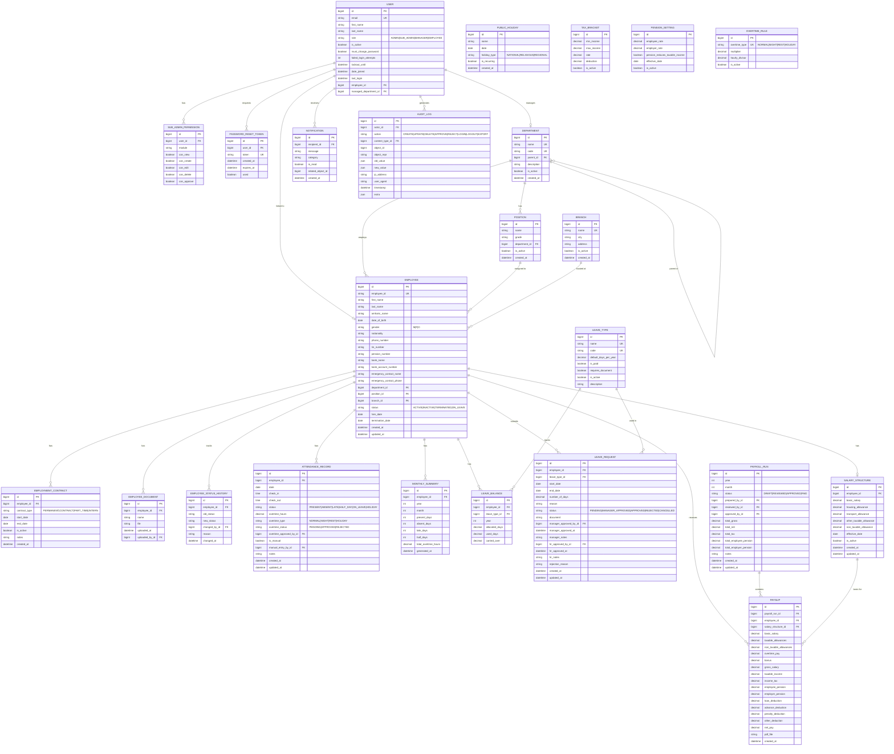

# Entity-Relationship Diagram

Complete ER diagram for the Ethiopian HR & Payroll Management System.

```mermaid
erDiagram

    %% ── ACCOUNTS ──────────────────────────────────────────────────────────
    USER {
        bigint id PK
        string email UK
        string first_name
        string last_name
        string role "ADMIN|SUB_ADMIN|MANAGER|EMPLOYEE"
        boolean is_active
        boolean must_change_password
        int failed_login_attempts
        datetime lockout_until
        datetime date_joined
        datetime last_login
        bigint employee_id FK
        bigint managed_department_id FK
    }

    SUB_ADMIN_PERMISSION {
        bigint id PK
        bigint user_id FK
        string module
        boolean can_view
        boolean can_create
        boolean can_edit
        boolean can_delete
        boolean can_approve
    }

    PASSWORD_RESET_TOKEN {
        bigint id PK
        bigint user_id FK
        string token UK
        datetime created_at
        datetime expires_at
        boolean used
    }

    %% ── ORGANIZATION ──────────────────────────────────────────────────────
    DEPARTMENT {
        bigint id PK
        string name UK
        string code UK
        bigint parent_id FK
        string description
        boolean is_active
        datetime created_at
    }

    POSITION {
        bigint id PK
        string name
        string grade
        bigint department_id FK
        boolean is_active
        datetime created_at
    }

    BRANCH {
        bigint id PK
        string name UK
        string city
        string address
        boolean is_active
        datetime created_at
    }

    PUBLIC_HOLIDAY {
        bigint id PK
        string name
        date date
        string holiday_type "NATIONAL|RELIGIOUS|REGIONAL"
        boolean is_recurring
        datetime created_at
    }

    %% ── EMPLOYEES ─────────────────────────────────────────────────────────
    EMPLOYEE {
        bigint id PK
        string employee_id UK
        string first_name
        string last_name
        string amharic_name
        date date_of_birth
        string gender "M|F|O"
        string nationality
        string phone_number
        string tin_number
        string pension_number
        string bank_name
        string bank_account_number
        string emergency_contact_name
        string emergency_contact_phone
        bigint department_id FK
        bigint position_id FK
        bigint branch_id FK
        string status "ACTIVE|INACTIVE|TERMINATED|ON_LEAVE"
        date hire_date
        date termination_date
        datetime created_at
        datetime updated_at
    }

    EMPLOYMENT_CONTRACT {
        bigint id PK
        bigint employee_id FK
        string contract_type "PERMANENT|CONTRACT|PART_TIME|INTERN"
        date start_date
        date end_date
        boolean is_active
        string notes
        datetime created_at
    }

    EMPLOYEE_DOCUMENT {
        bigint id PK
        bigint employee_id FK
        string name
        string file
        datetime uploaded_at
        bigint uploaded_by_id FK
    }

    EMPLOYEE_STATUS_HISTORY {
        bigint id PK
        bigint employee_id FK
        string old_status
        string new_status
        bigint changed_by_id FK
        string reason
        datetime changed_at
    }

    %% ── ATTENDANCE ────────────────────────────────────────────────────────
    ATTENDANCE_RECORD {
        bigint id PK
        bigint employee_id FK
        date date
        time check_in
        time check_out
        string status "PRESENT|ABSENT|LATE|HALF_DAY|ON_LEAVE|HOLIDAY"
        decimal overtime_hours
        string overtime_type "NORMAL|NIGHT|REST|HOLIDAY"
        string overtime_status "PENDING|APPROVED|REJECTED"
        bigint overtime_approved_by_id FK
        boolean is_manual
        bigint manual_entry_by_id FK
        string notes
        datetime created_at
        datetime updated_at
    }

    MONTHLY_SUMMARY {
        bigint id PK
        bigint employee_id FK
        int year
        int month
        int present_days
        int absent_days
        int late_days
        int half_days
        decimal total_overtime_hours
        datetime generated_at
    }

    %% ── LEAVE ─────────────────────────────────────────────────────────────
    LEAVE_TYPE {
        bigint id PK
        string name UK
        string code UK
        decimal default_days_per_year
        boolean is_paid
        boolean requires_document
        boolean is_active
        string description
    }

    LEAVE_BALANCE {
        bigint id PK
        bigint employee_id FK
        bigint leave_type_id FK
        int year
        decimal allocated_days
        decimal used_days
        decimal carried_over
    }

    LEAVE_REQUEST {
        bigint id PK
        bigint employee_id FK
        bigint leave_type_id FK
        date start_date
        date end_date
        decimal number_of_days
        string reason
        string status "PENDING|MANAGER_APPROVED|APPROVED|REJECTED|CANCELLED"
        string document
        bigint manager_approved_by_id FK
        datetime manager_approved_at
        string manager_notes
        bigint hr_approved_by_id FK
        datetime hr_approved_at
        string hr_notes
        string rejection_reason
        datetime created_at
        datetime updated_at
    }

    %% ── PAYROLL ───────────────────────────────────────────────────────────
    TAX_BRACKET {
        bigint id PK
        decimal min_income
        decimal max_income
        decimal rate
        decimal deduction
        boolean is_active
    }

    PENSION_SETTING {
        bigint id PK
        decimal employee_rate
        decimal employer_rate
        boolean pension_reduces_taxable_income
        date effective_date
        boolean is_active
    }

    OVERTIME_RULE {
        bigint id PK
        string overtime_type UK "NORMAL|NIGHT|REST|HOLIDAY"
        decimal multiplier
        decimal hourly_divisor
        boolean is_active
    }

    SALARY_STRUCTURE {
        bigint id PK
        bigint employee_id FK
        decimal basic_salary
        decimal housing_allowance
        decimal transport_allowance
        decimal other_taxable_allowance
        decimal non_taxable_allowance
        date effective_date
        boolean is_active
        datetime created_at
        datetime updated_at
    }

    PAYROLL_RUN {
        bigint id PK
        int year
        int month
        string status "DRAFT|REVIEWED|APPROVED|PAID"
        bigint prepared_by_id FK
        bigint reviewed_by_id FK
        bigint approved_by_id FK
        decimal total_gross
        decimal total_net
        decimal total_tax
        decimal total_employee_pension
        decimal total_employer_pension
        string notes
        datetime created_at
        datetime updated_at
    }

    PAYSLIP {
        bigint id PK
        bigint payroll_run_id FK
        bigint employee_id FK
        bigint salary_structure_id FK
        decimal basic_salary
        decimal taxable_allowances
        decimal non_taxable_allowances
        decimal overtime_pay
        decimal bonus
        decimal gross_salary
        decimal taxable_income
        decimal income_tax
        decimal employee_pension
        decimal employer_pension
        decimal loan_deduction
        decimal advance_deduction
        decimal penalty_deduction
        decimal other_deduction
        decimal net_pay
        string pdf_file
        datetime created_at
    }

    %% ── NOTIFICATIONS ─────────────────────────────────────────────────────
    NOTIFICATION {
        bigint id PK
        bigint recipient_id FK
        string message
        string category
        boolean is_read
        bigint related_object_id
        datetime created_at
    }

    %% ── AUDIT ─────────────────────────────────────────────────────────────
    AUDIT_LOG {
        bigint id PK
        bigint actor_id FK
        string action "CREATE|UPDATE|DELETE|APPROVE|REJECT|LOGIN|LOGOUT|EXPORT"
        bigint content_type_id FK
        bigint object_id
        string object_repr
        json old_value
        json new_value
        string ip_address
        string user_agent
        datetime timestamp
        json extra
    }

    %% ── RELATIONSHIPS ─────────────────────────────────────────────────────

    USER ||--o| EMPLOYEE : "linked to"
    USER ||--o| DEPARTMENT : "manages"
    USER ||--o{ SUB_ADMIN_PERMISSION : "has"
    USER ||--o{ PASSWORD_RESET_TOKEN : "requests"

    DEPARTMENT ||--o{ DEPARTMENT : "parent of"
    DEPARTMENT ||--o{ POSITION : "has"
    DEPARTMENT ||--o{ EMPLOYEE : "employs"

    POSITION ||--o{ EMPLOYEE : "assigned to"
    BRANCH ||--o{ EMPLOYEE : "located at"

    EMPLOYEE ||--o{ EMPLOYMENT_CONTRACT : "has"
    EMPLOYEE ||--o{ EMPLOYEE_DOCUMENT : "has"
    EMPLOYEE ||--o{ EMPLOYEE_STATUS_HISTORY : "tracks"
    EMPLOYEE ||--o{ ATTENDANCE_RECORD : "has"
    EMPLOYEE ||--o{ MONTHLY_SUMMARY : "has"
    EMPLOYEE ||--o{ LEAVE_BALANCE : "has"
    EMPLOYEE ||--o{ LEAVE_REQUEST : "submits"
    EMPLOYEE ||--o| SALARY_STRUCTURE : "has"
    EMPLOYEE ||--o{ PAYSLIP : "receives"

    LEAVE_TYPE ||--o{ LEAVE_BALANCE : "tracks"
    LEAVE_TYPE ||--o{ LEAVE_REQUEST : "used in"

    PAYROLL_RUN ||--o{ PAYSLIP : "contains"
    SALARY_STRUCTURE ||--o{ PAYSLIP : "basis for"

    USER ||--o{ NOTIFICATION : "receives"
    USER ||--o{ AUDIT_LOG : "generates"
```
